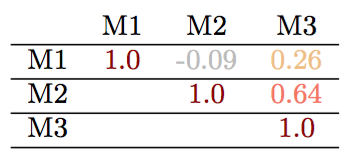

# latex-correlations-matrix

Input: CSV-file with correlations, output: nicely formatted content to use in a latex table

## Example

Input CSV file
```csv
M1,M2,M3
1.0,-0.0936716973315424,0.2625337112778693
-0.0936716973315424,1.0,0.636044725405646
0.2625337112778693,0.636044725405646,1.0
```

The command
```shell
python latex-correlations-matrix.py example/input.csv --delimiter ','
```
yields the following output:
```latex
& M1 & M2 & M3\\ \hline
M1 & \textcolor{cor-very-strong}{1.0} & \textcolor{cor-very-weak}{-0.09} & \textcolor{cor-weak}{0.26}\\ \hline
M2 &  & \textcolor{cor-very-strong}{1.0} & \textcolor{cor-strong}{0.64}\\ \hline
M3 &  &  & \textcolor{cor-very-strong}{1.0}\\ \hline
```

Pasted into a table frame:
```latex
\begin{table}[ht]
\begin{tabular}{cccc}
  & M1 & M2 & M3\\ \hline
  M1 & \textcolor{cor-very-strong}{1.0} & \textcolor{cor-very-weak}{-0.09} & \textcolor{cor-weak}{0.26}\\ \hline
  M2 &  & \textcolor{cor-very-strong}{1.0} & \textcolor{cor-strong}{0.64}\\ \hline
  M3 &  &  & \textcolor{cor-very-strong}{1.0}\\ \hline
\end{tabular}
\caption{Cool table}
\label{tab:metrics-correlations}
\end{table}
```

Visual result:




## Requirements

You need the following packages in your document preamble:

```latex
\usepackage[dvipsnames]{xcolor}
\usepackage[underline=true,rounded corners=false]{pgf-umlsd}
\definecolor{cor-very-weak}{HTML}{BBBBBB}
\definecolor{cor-weak}{HTML}{EEBD84}
\definecolor{cor-moderate}{HTML}{F47461}
%\definecolor{cor-strong}{HTML}{CB2F44}
\definecolor{cor-strong}{HTML}{F47461}
\definecolor{cor-very-strong}{HTML}{8B0000}

\newcommand{\hcancel}[1]{%
    \tikz[baseline=(tocancel.base)]{
        \node[inner sep=0pt,outer sep=0pt] (tocancel) {#1};
        \draw[line width=0.5mm, black] (tocancel.south west) -- (tocancel.north east);
    }%
}%
```

The resulting output could be pasted into the following table:
```latex
\begin{table}[ht]
\tiny
\setlength{\tabcolsep}{0.5pt}
\begin{tabular}{ccccc}

< PASTE OUTPUT HERE >

\end{tabular}
\caption{Cool table}
\label{tab:metrics-correlations}
\end{table}
```

## Usage

```shell
python latex-correlations-matrix.py path/to/file --delimiter ';' --strikethrough A--B D--F
```

### Parameters

- `file` path to the CSV file
- (optional) `-d, --delimiter` specifies the column delimiter of the CSV file
- (optional) `-s --strikethrough` specifies pairs of columns by their header names, which should be striked through

